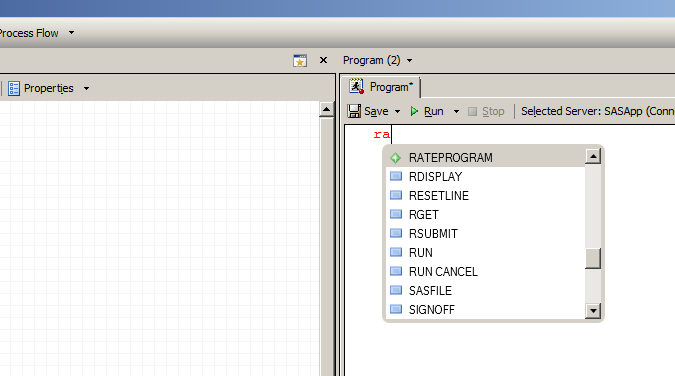

[](https://travis-ci.org/SKDE-Analyse/sas_codes)
[](https://skde-analyse.github.io/sas_codes)

# En kombinasjon av SAS-kode-repositoriene ved SKDE

Se [denne siden](monorepo) for en beskrivelse av hvordan alt ble samlet.

# SAS-makroer utviklet og brukt ved SKDE

## Bruke makroene

Makroene ligger her:
```
\\tos-sas-skde-01\SKDE_SAS\felleskoder\master\makroer\
```
For å bruke de i din egen SAS-kode, legges følgende inn i koden:
```
%let filbane=\\tos-sas-skde-01\SKDE_SAS\felleskoder\master;
options sasautos=("&filbane\Makroer" SASAUTOS);
```

Dokumentasjon om de ulike makroene finnes [her](http://skde-analyse.github.io/sas_codes/)

## Lage en ny makro

I korte trekk gjør man følgende

1. Kopier mappen `\\tos-sas-skde-01\SKDE_SAS\felleskoder\master` og jobb i den kopierte mappen.
2. Lag en sas-fil som heter det samme som makroen man vil lage.
3. Lag makroen, og dokumenter den.
4. Lag en test
5. Dytt opp til egen `branch` på [github](https://github.com/SKDE-Analyse/sas_codes) og lag en `pull request` (ev. be [Arnfinn](https://github.com/arnfinn) gjøre det).
6. Oppdater `\\tos-sas-skde-01\SKDE_SAS\felleskoder\master` (`git pull --rebase`, ev. be Arnfinn gjøre det) 


### Eksempel på makro

Eksempel på makro, som legges i en fil som heter `minNyeMakro.sas`:
```
%macro minNyeMakro(datasett =, variabel1 = );

/*!
Min dokumentasjon av makroen minNyeMakro

Makroene dokumenteres direkte i koden.
*/

sas-kode...

%mend;
```

### Dokumentering av makroen

Legg inn en forklaring om hva makroen gjør rett under `%macro minNyeMakro;`. Start kommentaren med `/*!` (legg merke til `!` etter `/*`). Alt som ligger mellom `/*!` og `*/` vil legges på nett [(her)](http://skde-analyse.github.io/sas_codes/) etter at man har dyttet alt opp til *github*.


### Lage en test til makroen

Når man lager en makro burde man også lage en test. Denne kan så kjøres senere for å sjekke at makroen ikke er blitt ødelagt. en enkel test kan se slik ut:
```
%macro minNyeMakro_test(branch = master, debug = 0, lagNyRef = 0, lagNyStart = 0);

%include "\\tos-sas-skde-01\SKDE_SAS\felleskoder\&branch\makroer\minNyeMakro.sas";

data test;
set test.minNyeMakro_start;
run;

%minNyeMakro(variabel1 = test);

proc compare base=test.ref_minNyeMakro compare=test BRIEF WARNING LISTVAR;

%mend;
```
Her kjører man makroen på en kopi av datasettet `test.minNyeMakro_start` og tester at det er likt datasettet `test.ref_minNyeMakro`. Disse to datasettene er lagret på server på forhånd. Se i mappen `tests\` for eksempler på bruk av argumentene `branch`, `debug`, `lagNyRef` og `lagNyStart`. 

Legg denne testen i mappen `tests` i filen `minNyeMakro_test.sas`. Legg så inn følgende kode i filen `test_makroer.sas`:
```
%include "&filbane\makroer\tests\minNyeMakro_test.sas";
%minNyeMakro_test(branch = &branch, lagNyRef = &lagNyRef, lagNyStart = &lagNyStart);
```


### Dytte makroen opp til [github](https://github.com/SKDE-Analyse/sas_codes)

Man gjør følgende i mappen `\\tos-sas-skde-01\SKDE_SAS\felleskoder\<min_mappe>\` med *git-bash* etter at man har lagd en makro og dokumentert den (eventuelt endret dokumentasjonen i en makro):
```bash
git status # for å sjekke at alt er som det skal
git diff # for å sjekke litt ekstra nøye
git checkout -b <branchname> # endre branch (bytt ut `<branchname>` med ønsket navn på branch).
git add <filnavn.sas> # Legg inn filene som skal dyttes opp (her legger vi til filen `filnavn.sas`)
git commit -m 'My new fancy macro, with doc and test' # Skriv en pen commit-beskjed
git push -u origin branchname # Dytt opp til github
```

Gå så inn på [github/branches](https://github.com/SKDE-Analyse/sas_codes/branches) og trykk på *New pull request* ved siden av din nye branch. Fyll ut og be en kollega se på hva du har gjort (legg inn en *Reviewer*).


# Rateprogrammet

- Beregner kjønns- og aldersjusterte rater for ulike boområder.
- Utviklet av Frank Olsen

## Hvordan bruke rateprogrammet

- Ha oppdatert *automacro*, se [her](http://skde-analyse.github.io/dokumentasjon/sas.html#macroer)
- Åpne et nytt program i SAS, begynn å skriv `rate` og velg `RATEPROGRAM`



- Da vil man få inn kode som kan kjøre rateprogrammet. Pr. 21. juni 2018 ser denne [slik ut](RateprogramAuto).

## Hvordan endre rateprogrammet

- [Prosedyrer for utvikling av koden](kode)
- [Prosedyrer for testing av koden](testing)
- [Forslag til endringer av rateprogrammet](endringer)


# SAS-koder for tilrettelegging av NPR-data

## Kjøre tilretteleggingen av NPR-data

Først må makro-filene inkluderes i prosjektet:

```
%let kodebane = \\tos-sas-skde-01\SKDE_SAS\felleskoder\tilrettelegging\npr;

%include "&kodebane\Formater.sas";

%include "&kodebane\1_Macro-Konvertering_og_stringrydding.sas";
%include "&kodebane\2_Macro-Bo_og_behandler.sas";
%include "&kodebane\3_Macro-ICD10.sas";
%include "&kodebane\4_Macro-Ovrige_avledede_variable.sas";
%include "&kodebane\5_Macro-Lage_unik_ID.sas";
%include "&kodebane\6_Macro-Labler_og_formater.sas";
%include "&kodebane\7_Macro-Redusere_variabelstorrelser.sas";
%include "&kodebane\8_Macro-Dele_datasett.sas";
```

Så inkluderes kjørefilen (da kjøres alle makroene):

```
%include "&kodebane\Kjoring_av_macroer.sas";
```

## Kjøre tilrettelegging av innbyggertall fra SSB

Følgende kode ble kjørt for å legge til innbyggertallene 1. januar 2018:
```
%let kodebane = \\tos-sas-skde-01\SKDE_SAS\felleskoder\tilrettelegging\ssb;
%include "&kodebane\lesSSBdata.sas";

%lesSSBdata(aar=2018, utdata = bydel, bydel = 1);

%lesSSBdata(aar=2018, utdata = kommune, bydel = 0);

data innbygg.innb_2004_2017_bydel_allebyer;
set innbygg.innb_2004_2016_bydel_allebyer kommune bydel;
run;
```

Se ellers [SKDE-dokumentasjon](https://skde-analyse.github.io/dokumentasjon/tilrettelegging-av-data.html#tilrettelegging-av-innbyggertall-fra-ssb).


