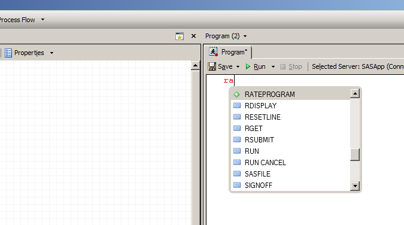

# Rateprogrammet

- Beregner kjønns- og aldersjusterte rater for ulike boområder.
- Utviklet av Frank Olsen

## Hvordan bruke rateprogrammet

- Ha oppdatert *automacro*, se [her](https://skde-analyse.github.io/dokumentasjon/sas.html#laste-inn-v%C3%A5r-egen-autocomplete-fil)
- Åpne et nytt program i SAS, begynn å skriv `rate` og velg `RATEPROGRAM`

- Da vil man få inn kode som kan kjøre rateprogrammet. Pr. 2. november 2022 ser denne [slik ut](RateprogramAuto).
