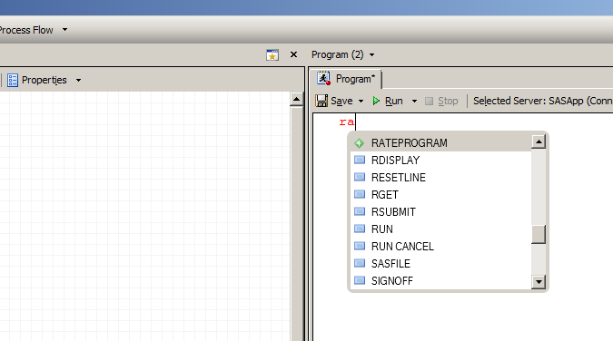

# Rateprogrammet

## Hvordan bruke rateprogrammet

- Ha oppdatert *automacro*, se [her](http://skde.readthedocs.io/en/master/sas.html#laste-inn-var-egen-autocomplete-fil)
- Åpne et nytt program i SAS, begynn å skriv `rate` og velg `RATEPROGRAM`

- Da vil man få inn kode som kan kjøre rateprogrammet. Pr. 29. juni 2017 ser denne [slik ut](Rateprogram).

## Beskrivelse av rateprogrammet

- [Kodebeskrivelse](kode)
- [Prosedyrer for testing av koden](testing)
- [Potensielle endringer av rateprogrammet](endringer)

